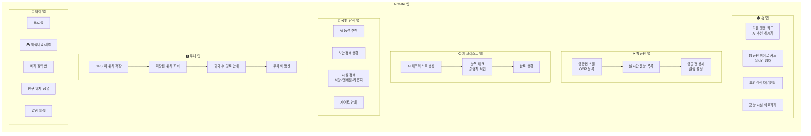
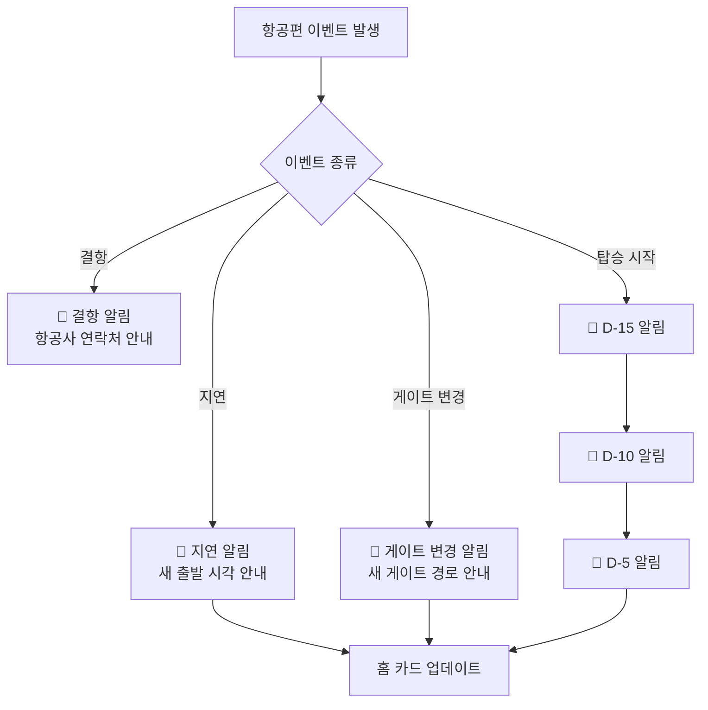
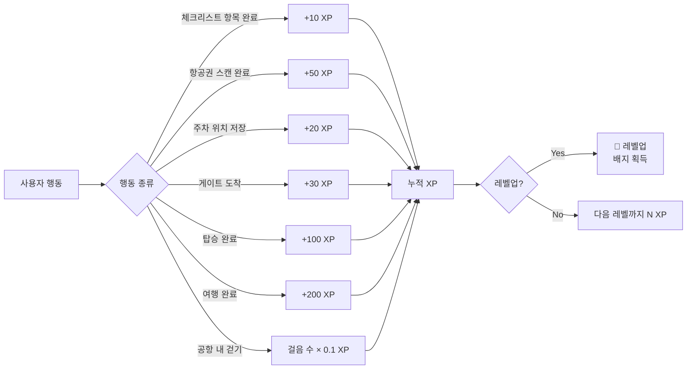

# AirMate — 유저플로우

> 실제 출국자의 행동 흐름을 기준으로 설계된 서비스 플로우

---

## 전체 여정 플로우

```mermaid
flowchart TD
    START([앱 최초 설치]) --> ONBOARD[온보딩\n여행 스타일 설정]
    ONBOARD --> SCAN

    RETURN([앱 재진입]) --> HOME

    subgraph BEFORE["🏠 D-몇일 전 — 집에서 출국 준비"]
        SCAN[📸 항공권 스캔\nOCR 자동 인식] --> FLIGHT_REG[항공편 자동 등록\n편명·게이트·터미널]
        FLIGHT_REG --> CHECKLIST_GEN[🤖 AI 체크리스트 자동 생성\n목적지·일정·날씨 기반]
        CHECKLIST_GEN --> CHECKLIST_DO[📋 체크리스트 완료\n항목별 체크 → 경험치 적립]
        CHECKLIST_DO --> PASSPORT[📄 여권·서류 확인\n만료일 알림]
    end

    PASSPORT --> HOME

    subgraph DAY["✈️ 출발 당일"]
        HOME[🏠 홈\n다음 행동 카드] --> TIMING[⏰ AI 출발 타이밍 추천\n교통상황·통행료·공항 도착 권장시간]
        TIMING --> DEPART{지금 출발?}
        DEPART -->|네| DRIVE[🚗 출발\n내비 연동]
        DEPART -->|아직| HOME
    end

    subgraph PARKING["🅿️ 공항 도착 — 주차"]
        DRIVE --> PARK[🅿️ 주차\nGPS + 층·구역 저장]
        PARK --> PARK_SAVE[차 위치 저장 완료\n귀국 후 안내 준비]
    end

    subgraph TERMINAL["🏢 터미널 진입 — 체크인"]
        PARK_SAVE --> CHECKIN[체크인 카운터\n위치 안내]
        CHECKIN --> BAGGAGE[수하물 위탁\n마감 타이머 확인]
        BAGGAGE --> SECURITY_NAV[🧭 보안검색 라인 추천\n가장 빠른 라인 안내]
    end

    subgraph SECURITY["🔒 보안검색 & 출국심사"]
        SECURITY_NAV --> SECURITY_WAIT[대기시간 실시간 확인]
        SECURITY_WAIT --> IMMIGRATION[출국심사 대기\n예상 시간 안내]
    end

    subgraph AIRSIDE["🛍️ 면세구역 — 탑승 전"]
        IMMIGRATION --> GATE_CHECK[게이트 위치 확인\n이동 소요시간 계산]
        GATE_CHECK --> FREE_TIME{여유 시간?}
        FREE_TIME -->|있음| EXPLORE[🏢 공항 시설 탐색\n식당·면세점·라운지 추천]
        FREE_TIME -->|없음| GATE_MOVE
        EXPLORE --> GATE_MOVE[게이트로 이동\n경로 안내]
    end

    subgraph BOARDING["🛫 탑승"]
        GATE_MOVE --> ALERT_15[🔔 탑승 D-15 알림]
        ALERT_15 --> ALERT_10[🔔 탑승 D-10 알림]
        ALERT_10 --> ALERT_5[🔔 탑승 D-5 알림\n게이트 변경 실시간 확인]
        ALERT_5 --> BOARD[탑승 완료\n🎮 비행 완료 경험치]
    end

    subgraph RETURN_FLOW["🏠 귀국 — 집으로"]
        BOARD --> LAND[귀국 착륙]
        LAND --> PARK_FIND[📍 저장된 차 위치 안내\nGPS 경로 복원]
        PARK_FIND --> PARKING_FEE[💰 실제 주차비 정산\n예상 vs 실제]
        PARKING_FEE --> HOME_NAV[🛣️ 귀가 경로 추천]
        HOME_NAV --> BADGE[🎮 여행 완료 배지 획득\n캐릭터 성장]
    end

    style BEFORE fill:#E8F8EE,stroke:#1DB954
    style DAY fill:#E8F0FF,stroke:#6B7FD4
    style PARKING fill:#FFF8E8,stroke:#FF8C42
    style TERMINAL fill:#F0F8FF,stroke:#4A90D9
    style SECURITY fill:#FFF0F0,stroke:#FF4757
    style AIRSIDE fill:#F0FFF4,stroke:#1DB954
    style BOARDING fill:#F8F0FF,stroke:#9B59B6
    style RETURN_FLOW fill:#FFF8E8,stroke:#FF8C42
```

---

## 화면 단위 플로우 (탭별)

```mermaid
flowchart LR
    subgraph APP["AirMate 앱"]
        direction TB

        subgraph TAB_HOME["🏠 홈 탭"]
            H1[다음 행동 카드\nAI 추천 메시지]
            H2[항공편 히어로 카드\n실시간 상태]
            H3[보안검색 대기현황]
            H4[공항 시설 바로가기]
        end

        subgraph TAB_FLIGHT["✈️ 항공편 탭"]
            F1[항공권 스캔\nOCR 등록]
            F2[실시간 운항 목록]
            F3[항공편 상세\n알림 설정]
            F1 --> F2 --> F3
        end

        subgraph TAB_CHECKLIST["📋 체크리스트 탭"]
            C1[AI 체크리스트 생성]
            C2[항목 체크\n경험치 적립]
            C3[완료 현황]
            C1 --> C2 --> C3
        end

        subgraph TAB_MAP["🧭 공항 탐색 탭"]
            M1[AI 동선 추천]
            M2[보안검색 현황]
            M3[시설 검색\n식당·면세점·라운지]
            M4[게이트 안내]
        end

        subgraph TAB_PARKING["🅿️ 주차 탭"]
            P1[GPS 차 위치 저장]
            P2[저장된 위치 조회]
            P3[귀국 후 경로 안내]
            P4[주차비 정산]
            P1 --> P2 --> P3 --> P4
        end

        subgraph TAB_MY["👤 마이 탭"]
            MY1[프로필]
            MY2[🎮 캐릭터 & 레벨]
            MY3[배지 컬렉션]
            MY4[친구 위치 공유]
            MY5[알림 설정]
        end
    end
```

---

## 알림 트리거 플로우

```mermaid
flowchart TD
    EVENT[항공편 이벤트 발생] --> TYPE{이벤트 종류}

    TYPE -->|지연| DELAY[🔔 지연 알림\n새 출발 시각 안내]
    TYPE -->|게이트 변경| GATE[🔔 게이트 변경 알림\n새 게이트 경로 안내]
    TYPE -->|결항| CANCEL[🚨 결항 알림\n항공사 연락처 안내]
    TYPE -->|탑승 시작| BOARD_15[🔔 D-15 알림]

    BOARD_15 --> BOARD_10[🔔 D-10 알림]
    BOARD_10 --> BOARD_5[🔔 D-5 알림]

    DELAY --> HOME_UPDATE[홈 카드 업데이트]
    GATE --> HOME_UPDATE
    BOARD_5 --> HOME_UPDATE
```

---

## 경험치 & 게임화 플로우

```mermaid
flowchart LR
    ACTION[사용자 행동] --> TYPE{행동 종류}

    TYPE -->|체크리스트 항목 완료| EXP_10[+10 XP]
    TYPE -->|항공권 스캔 완료| EXP_50[+50 XP]
    TYPE -->|주차 위치 저장| EXP_20[+20 XP]
    TYPE -->|게이트 도착| EXP_30[+30 XP]
    TYPE -->|탑승 완료| EXP_100[+100 XP]
    TYPE -->|여행 완료| EXP_200[+200 XP]
    TYPE -->|공항 내 걷기| EXP_WALK[걸음 수 × 0.1 XP]

    EXP_10 & EXP_50 & EXP_20 & EXP_30 & EXP_100 & EXP_200 & EXP_WALK --> TOTAL[누적 XP]
    TOTAL --> LEVEL{레벨업?}
    LEVEL -->|Yes| LEVELUP[🎉 레벨업\n배지 획득]
    LEVEL -->|No| NEXT[다음 레벨까지 N XP]
```
